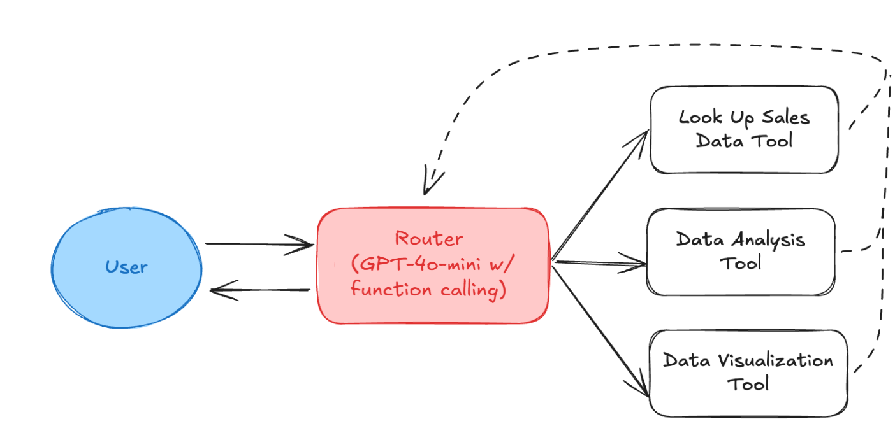
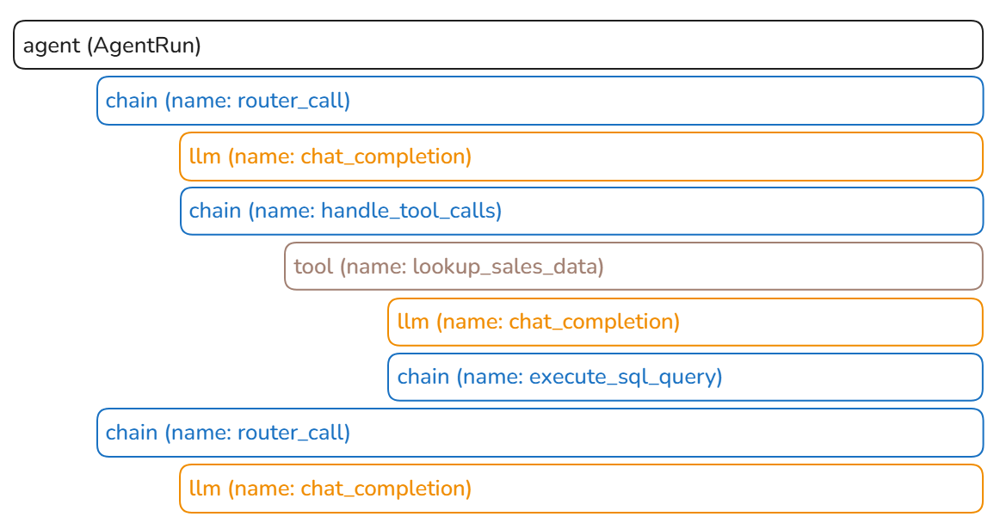
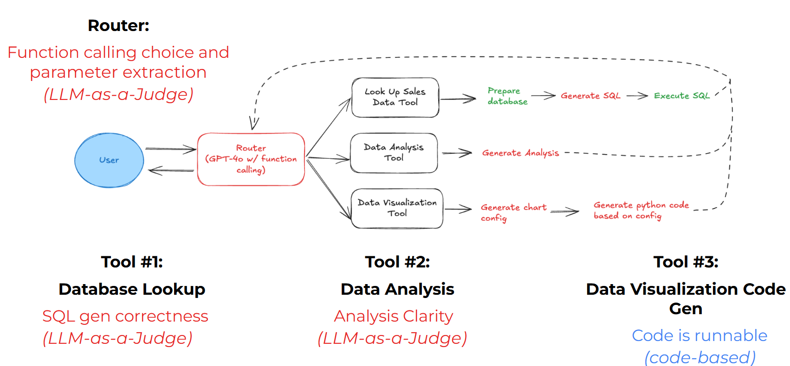
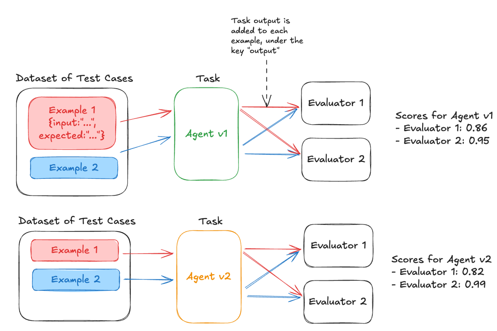
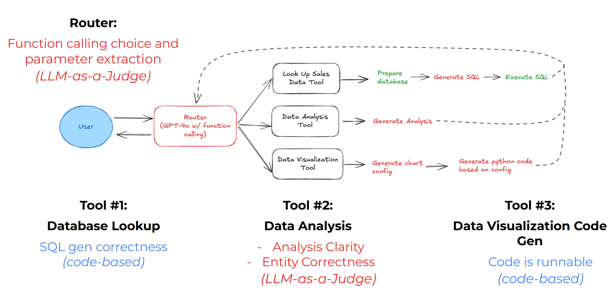

# AI Agent Evaluation Framework

## Overview

This repository contains tools, techniques, and resources for evaluating AI agents in production environments. Based on the [Evaluating AI Agents](https://learn.deeplearning.ai/courses/evaluating-ai-agents/lesson/sqkza/introduction?courseName=evaluating-ai-agents) course from DeepLearning.AI, this framework walks through building a sales-data AI agent and systematically evaluating it using Arize Phoenix — covering tracing, LLM-as-a-judge evaluators, trajectory analysis, and structured experiments.

The agent being evaluated is a sales analytics assistant that answers natural-language questions about a retail dataset using three tools:

- **Database Lookup** — translates user questions into SQL and queries a Parquet file via DuckDB
- **Data Analysis** — interprets query results and generates textual insights
- **Data Visualization** — generates Python charting code from the query results



## Why Agent Evaluation Matters

When building AI agents for personal use or experimentation, efficiency metrics like API call count or reasoning steps might not seem important. However, in production:

- Each unnecessary API call increases costs
- Extra reasoning steps create higher latency
- Inefficient paths cause scaling problems

**What works in your notebook will often break in production.**

## Prerequisites

- Python 3.9+
- An [OpenAI API key](https://platform.openai.com/api-keys) (GPT-4o-mini is used throughout)
- [Arize Phoenix](https://docs.arize.com/phoenix/) running locally (`phoenix serve`) or via a hosted endpoint

## Getting Started

1. **Clone the repository**

   ```bash
   git clone https://github.com/buzz39/evaluating-ai-agents.git
   cd evaluating-ai-agents
   ```

2. **Install dependencies**

   ```bash
   pip install openai arize-phoenix openinference-instrumentation-openai \
               opentelemetry-sdk pandas duckdb pydantic python-dotenv \
               nest-asyncio
   ```

3. **Configure your API keys**

   Set the following environment variables (or update `helper.py`):

   ```bash
   export OPENAI_API_KEY="your-openai-api-key"
   export PHOENIX_COLLECTOR_ENDPOINT="http://localhost:6006/"
   ```

4. **Start Arize Phoenix**

   ```bash
   phoenix serve
   ```

5. **Open the notebooks** in order (1 → 5) using Jupyter Lab or Jupyter Notebook.

## Repository Structure

```
evaluating-ai-agents/
├── 1-building-agent.ipynb          # Build the three-tool sales agent
├── 2-tracing-agent.ipynb           # Add OpenTelemetry tracing with Arize Phoenix
├── 3-router-skill-evaluation.ipynb # LLM-as-a-judge evaluators for router & tools
├── 4-trajectory-evaluation.ipynb   # Trajectory / path-length evaluations
├── 5-strucutre-to-evaluation.ipynb # Structured experiments with Phoenix
├── data/
│   └── Store_Sales_Price_Elasticity_Promotions_Data.parquet
├── images/                         # Diagrams used in the notebooks
├── utils.py                        # Agent + tracing utilities (Labs 2–3)
├── utils4.py                       # Agent utilities for Lab 4
├── utils5.py                       # Agent utilities for Lab 5
└── helper.py                       # Environment / API key helpers
```

## Notebooks

### Lab 1 — Building the Agent (`1-building-agent.ipynb`)

Constructs the three-tool sales analytics agent from scratch using OpenAI function calling. Covers tool definition, the router loop, and a live end-to-end test run.

### Lab 2 — Tracing the Agent (`2-tracing-agent.ipynb`)

Instruments the agent with [OpenInference](https://github.com/Arize-ai/openinference) and OpenTelemetry spans, sending traces to a local Arize Phoenix instance. Introduces span kinds (`agent`, `chain`, `tool`) and shows how to inspect the agent's internal steps in the Phoenix UI.



### Lab 3 — Router & Skill Evaluations (`3-router-skill-evaluation.ipynb`)

Implements **LLM-as-a-judge** evaluators for each component of the agent:

- **Router eval** — verifies that the correct tool was selected and that arguments were extracted properly (uses Phoenix's built-in `TOOL_CALLING_PROMPT_TEMPLATE`)
- **Tool 1 eval** — checks SQL query correctness
- **Tool 2 eval** — scores the clarity and correctness of the analysis narrative
- **Tool 3 eval** — validates the generated Python visualization code



### Lab 4 — Trajectory Evaluations (`4-trajectory-evaluation.ipynb`)

Uses Phoenix **Experiments** to measure agent convergence (path length). Defines a dataset of test questions, runs the agent on each, and evaluates whether the agent reaches the correct answer in the minimum number of steps.

### Lab 5 — Adding Structure to Evaluations (`5-strucutre-to-evaluation.ipynb`)

Puts everything together in a fully structured experiment pipeline:

- Creates a Phoenix dataset of test examples with expected outputs
- Defines task and evaluator functions
- Runs baseline and prompt-modified experiments side-by-side
- Optionally uses the Phoenix **Playground** to compare prompt variants




## Key Evaluation Methods

| Method | Description | Labs |
|---|---|---|
| **LLM-as-a-Judge** | Uses a language model to score agent outputs against a rubric | 3, 5 |
| **Trajectory Evaluation** | Measures path length and convergence score of the agent | 4 |
| **Structured Experiments** | Runs dataset-driven experiments and compares multiple agent variants | 5 |

## Course Reference

This repository is inspired by the **"Evaluating AI Agents"** course from DeepLearning.AI, taught by Andrew Ng, John Gilhuly, and Aman Berkeley:

🔗 https://learn.deeplearning.ai/courses/evaluating-ai-agents/lesson/sqkza/introduction?courseName=evaluating-ai-agents

## Additional Resources

- **[Arize Phoenix Documentation](https://docs.arize.com/phoenix/)** — observability platform used throughout this course
- **[OpenInference Instrumentation](https://github.com/Arize-ai/openinference)** — OpenTelemetry-compatible tracing for LLM apps
- **[Tracing and Evaluating AI Agents built with LlamaIndex's Workflows](https://github.com/run-llama/llama_index/tree/main/docs/examples/agent/agent_runner_openai_tracing.ipynb)**
- **[Evaluating a LangChain tool-calling agent](https://github.com/langchain-ai/langchain/blob/master/cookbook/agent_with_tool_retrieval.ipynb)** — [Video](https://www.youtube.com/watch?v=ahnGLM-RC1Y)
- **[Tracing and Evaluating LangGraph Agents](https://github.com/langchain-ai/langgraph/blob/main/examples/tracing/README.md)**
- **[Comparing Agent Frameworks](https://arxiv.org/abs/2308.03688)** — [Repository](https://github.com/microsoft/promptflow)
- **[Discussion of multi-agent framework with AutoGen](https://microsoft.github.io/autogen/)**
